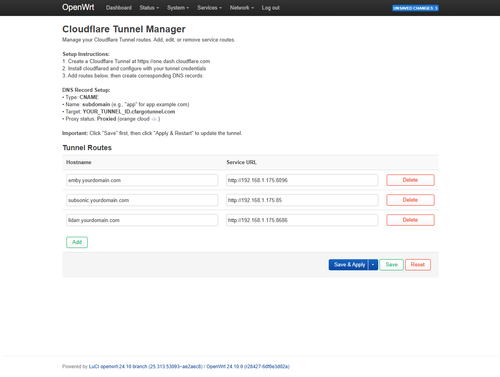
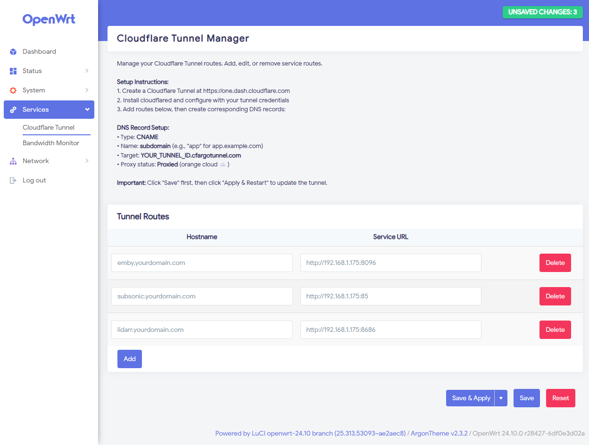

# LuCI App - Cloudflare Tunnel Manager

A web interface for managing Cloudflare Tunnel routes on OpenWrt routers.


## Features

- 🌐 **Web UI Management** - Manage Cloudflare Tunnel routes through LuCI web interface
- 🔄 **Easy Configuration** - Add, edit, and remove routes without SSH access
- 🚀 **One-Click Apply** - Generate config and restart cloudflared with a single button
- 📋 **Built-in Instructions** - DNS setup guide included in the interface
- ⚙️ **UCI Integration** - All settings stored in standard OpenWrt configuration

## Screenshots




## Prerequisites

- OpenWrt 24.10 or newer
- `cloudflared` package installed
- A configured Cloudflare Tunnel (see setup instructions below)

## Installation

### Step 1: Install cloudflared

```bash
ssh root@192.168.1.1
opkg update
opkg install cloudflared
```

### Step 2: Set up your Cloudflare Tunnel

1. Go to https://one.dash.cloudflare.com
2. Navigate to **Networks → Tunnels**
3. Click **Create a tunnel**
4. Choose **Cloudflared** tunnel type
5. Name your tunnel and save the tunnel ID and credentials

### Step 3: Configure cloudflared credentials

Create the credentials file on your router:

```bash
mkdir -p /etc/cloudflared
cat > /etc/cloudflared/cert.json << 'EOF'
{
  "AccountTag": "your_account_id",
  "TunnelSecret": "your_tunnel_secret",
  "TunnelID": "your_tunnel_id"
}
EOF
```

Replace the values with your actual tunnel credentials from Cloudflare.

### Step 4: Install LuCI App

Download the latest release and install:

```bash
cd /tmp
wget https://github.com/Concept211/luci-app-cloudflared-manager/releases/download/v1.2.0/luci-app-cloudflared-manager_1.2.0_all.ipk
opkg install luci-app-cloudflared-manager_1.2.0_all.ipk
```

Or install via LuCI:
1. Go to **System → Software**
2. Click **Upload Package...**
3. Select the downloaded `.ipk` file
4. Click **Upload**

### Step 5: Enable and start cloudflared

```bash
/etc/init.d/cloudflared enable
/etc/init.d/cloudflared start
```

## Usage

1. Navigate to **Services → Cloudflare Tunnel** in LuCI
2. Click **Add** to create a new route
3. Enter:
   - **Hostname**: Your full domain (e.g., `app.example.com`)
   - **Service URL**: Your internal service (e.g., `http://192.168.1.100:8080`)
4. Click **Save**
5. Click **Apply & Restart Cloudflared**

### Creating DNS Records

After adding a route, you must create a corresponding DNS record in Cloudflare:

1. Go to your Cloudflare dashboard
2. Select your domain
3. Go to **DNS → Records**
4. Click **Add record**:
   - **Type**: `CNAME`
   - **Name**: subdomain (e.g., `app` for `app.example.com`)
   - **Target**: `YOUR_TUNNEL_ID.cfargotunnel.com`
   - **Proxy status**: Proxied (orange cloud ☁️)
5. Click **Save**

Your service should now be accessible at `https://app.example.com`!

## Example Configuration

Here's an example setup for multiple services:

| Hostname | Service URL | Description |
|----------|-------------|-------------|
| `jellyfin.example.com` | `http://192.168.1.100:8096` | Jellyfin media server |
| `nas.example.com` | `http://192.168.1.101:5000` | NAS web interface |
| `home.example.com` | `http://192.168.1.1` | Router admin panel |

## Troubleshooting

### Routes not working after Save

Make sure you click the **"Apply & Restart Cloudflared"** button after saving changes.

### Service not accessible externally

1. Verify the DNS record is created in Cloudflare
2. Check that the DNS record is **Proxied** (orange cloud)
3. Verify cloudflared is running: `/etc/init.d/cloudflared status`
4. Check logs: `logread | grep cloudflared`

### Cannot access LuCI app

Clear browser cache and restart services:

```bash
rm -rf /tmp/luci-*
/etc/init.d/rpcd restart
/etc/init.d/uhttpd restart
```

## Uninstallation

```bash
opkg remove luci-app-cloudflared-manager
```

This will remove the web interface but keep your cloudflared installation and configuration.

## Building from Source

If you want to build the package yourself:

```bash
# Clone this repository
git clone https://github.com/yourusername/luci-app-cloudflared-manager
cd luci-app-cloudflared-manager

# Build package (requires OpenWrt build environment)
./build.sh
```

## Contributing

Contributions are welcome! Please feel free to submit a Pull Request.

## License

MIT License - see [LICENSE](LICENSE) file for details.

## Credits

- Created by [Concept211](https://concept211.com)
- Built for OpenWrt
- Uses Cloudflare Tunnel (cloudflared)

## Support

For issues, questions, or suggestions:
- Open an issue on GitHub
- Check existing issues for solutions

## Changelog

### v1.2.0 (2025-11-15)
- Initial release
- Web UI for managing tunnel routes
- Automatic config generation
- UCI integration
- Built-in setup instructions

## Related Projects

- [cloudflared](https://github.com/cloudflare/cloudflared) - Cloudflare Tunnel client
- [OpenWrt](https://openwrt.org) - The Linux distribution for embedded devices
